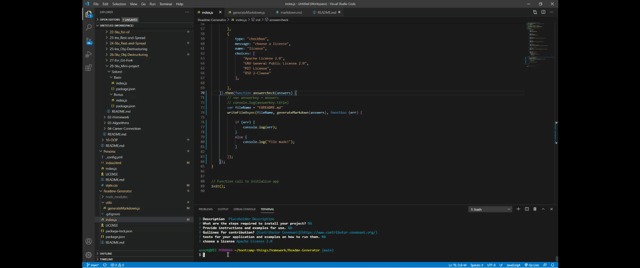

# Readme Generator
---
####
  ## a command line app accesible using nodejs that generates a basic readme etmmplate based on user input
  
  

  ```
function generateMarkdown(answers) {
  
  return `# ${answers.title}
  ---
  ## ${answers.description}
  ---
  ## Table of Contents
  * [Installation]${answers.installation}
  * [Usage]${answers.usage}
  * [Credits]${answers.license}
  * ${answers.license}
  #### Contributing
  ${answers.contribution}
  
`;
}

```
  ## Table of Contents
  * [Installation]N/A
  * [Usage]
  * [Credits]N/A
  * [License]MIT
  
  ### Contributing
  [Contributor Covenant](https://www.contributor-covenant.org/)
